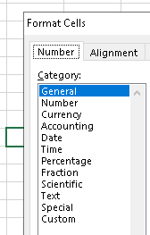

# xlsx_drone

[](#xlsx_drone)
[](#xlsx_drone)
[](https://github.com/damian-m-g/xlsx_drone/blob/master/test/xlsx_drone.test.c)
[](https://en.wikipedia.org/wiki/C11_(C_standard_revision))

Fast _Microsoft Excel's_ **\*.xlsx** reader.

## Table of contents

* [Features](#features)
* [Installation](#installation)
* [Usage](#usage)
    * [Essential](#essential)
    * [Extended](#extended)
* [Project Status](#project-status)
* [TODO](#todo)  
* [Credits & Thanks](#credits--thanks)
* [License](#license)

## Features

* Doesn't use any external application to parse them.
* Focus on speed over functionality.
* Simple interface.
* UTF-8 support.

## Installation

 Straightforward copy and paste of the _src_ and _ext_ folders into your project root folder and `#include "xlsx_drone.h"` in your source code. It's understandable that you might want to accommodate files differently, just note that _xlsx_drone.h_ calls its deppendencies with relative paths:

 ```c
// external libraries
#include "../ext/zip.h"
#include "../ext/sxmlc.h"
#include "../ext/sxmlsearch.h"
 ```

..., you might want to modify that according to your needs.

**NOTE**: You'll also find several dynamic library releases inside the _share_ folder for the current version that could be of usage.

## Usage

### Essential

```c
// open *.xlsx
xlsx_workbook_t wb;
xlsx_open("foo.xlsx", &wb);
// load sheet
xlsx_sheet_t *sheet_1 = xlsx_load_sheet(&wb, 1, NULL);
// read cell
xlsx_cell_t cell_data_holder;    
xlsx_read_cell(sheet_1, 4, "B", &cell_data_holder);
// inspect result
switch(cell_data_holder.value_type) {
  case XLSX_POINTER_TO_CHAR:
    printf("Cell 4B has value: %s", cell_data_holder.value.pointer_to_char_value);
    break;
  case XLSX_INT:
    printf("Cell 4B has value: %d", cell_data_holder.value.int_value);
    break;
  case XLSX_LONG_LONG:
    printf("Cell 4B has value: %lld", cell_data_holder.value.long_long_value);
    break;
  case XLSX_DOUBLE:
    printf("Cell 4B has value: %f", cell_data_holder.value.double_value);
    break;
  default:
    printf("Cell 4B has no value");
}
// you can also inspect the cell category
int cell_category = cell_data_holder.style->related_category
```

...which is one of:

```c
typedef enum xlsx_cell_category {
  XLSX_NUMBER, // int, long long, or double
  XLSX_TEXT, // string
  XLSX_DATE, // int
  XLSX_TIME, // double
  XLSX_DATE_TIME, // double
  XLSX_UNKNOWN
} xlsx_cell_category;
```

...which is a summary of what can be set in Excel:



Note that:

* _XLSX_TIME_ category is represented as a double between 0 and 1.
* _XLSX_DATE_ category is represented as an int that stars with 1 for the first day of 1900 and raises until the last day of 9999. Values that fall out of the range are represented as text (string) although they will be pointed as _XLSX_DATE_ if the cell has that category manually fixed.
* _XLSX_DATE_TIME_ category is a combination of XLSX_TIME and XLSX_DATE.

### Extended

This section shows brief descriptions of extra features of the library.

```c
// sets on and off errors printing in stdout (default: on (1))
void xlsx_set_print_err_messages(int flag);
// inspect xlsx_errno to know what happened after some function fails
int xlsx_get_xlsx_errno(void);

// if memory is of your concern, you can unload any loaded sheet if it's of no use
void xlsx_unload_sheet(xlsx_sheet_t *sheet);
```

The rest of the public functions will return 0 or NULL if fail, and 1 or a valid pointer for success. When they return 0 or NULL, you can check `xlsx_errno` and compare it against the respective error values of the function.

**For full documentation of the API, check [_src/xlsx_drone.h_](https://github.com/damian-m-g/xlsx_drone/blob/master/src/xlsx_drone.h).**

## Project Status

- [x] Reading capabilities for ASCII
- [x] Reading capabilities for UTF-8
- [ ] Writting capabilities (WIP)

## TODO

All ideas about new implementations are thoroughly thought to keep the essence of the library, which is to be fast and simple. Hence, next TODOs could be taken into account or dismissed based on that.

- Consider make xlsx_open() work independently of having the *.xlsx opened (grabbed) or closed. 
- Consider provide a function that tells the last column used of certain sheet (implementation difficulty: 8/10).

## Credits & Thanks

* Matthieu Labas for [**sxmlc**](http://sxmlc.sourceforge.net/).
* Kuba Podgórski for [**zip**](https://github.com/kuba--/zip).

## License

#### [MIT](https://github.com/damian-m-g/xlsx_drone/blob/master/LICENSE)


